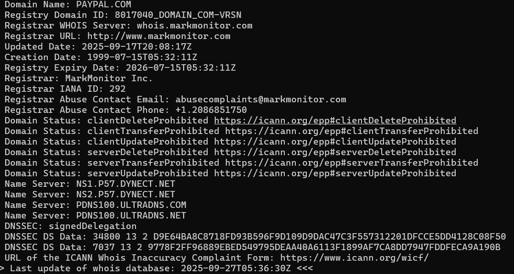
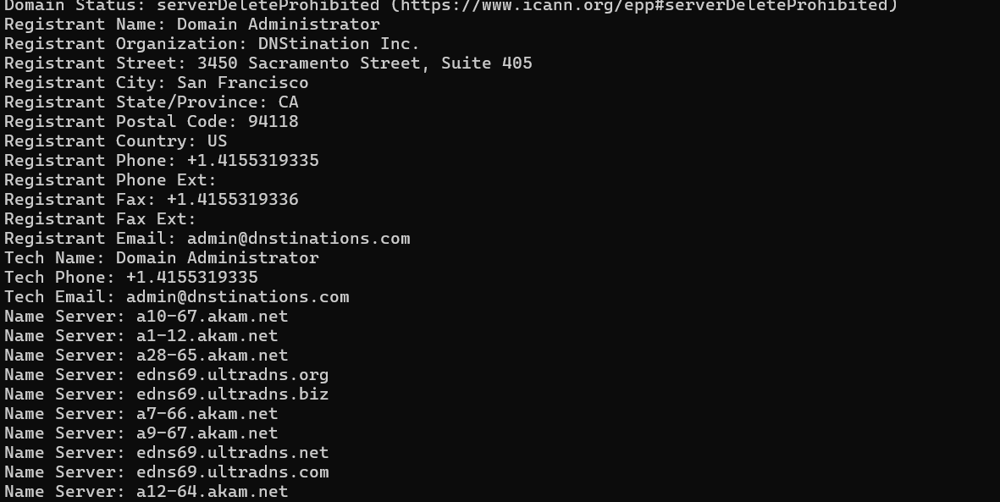
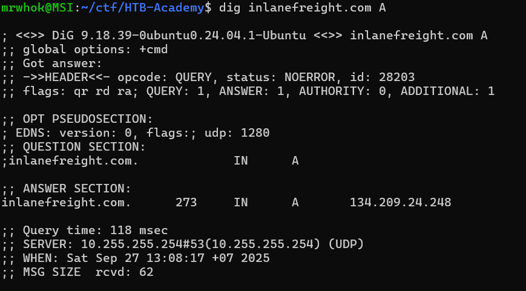
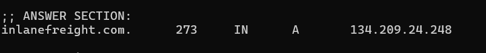
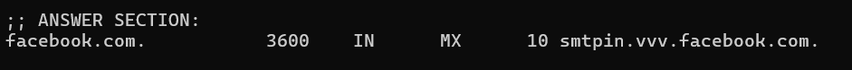
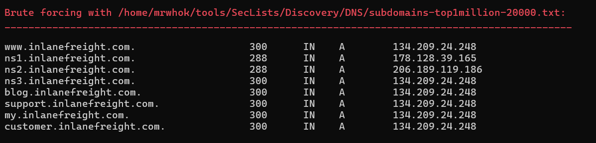
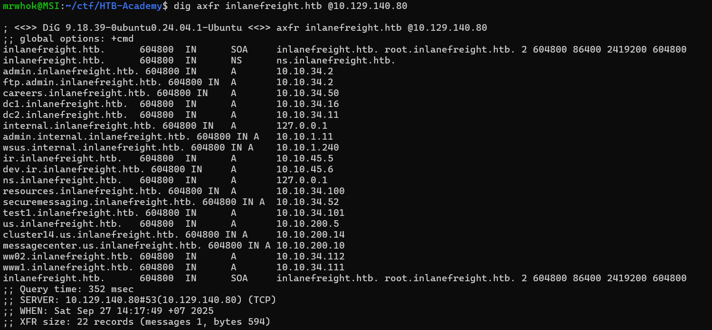
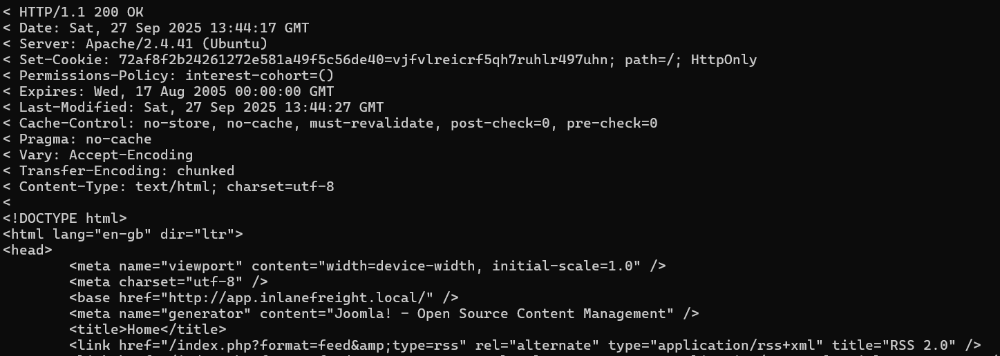

# HTB Academy - Information Gathering - Web Edition Write-up

## Table of Contents
1. [whois](#whois)
2. [DNS and Subdomains](#dns-and-subdomains)
    1. [Digging DNS](#digging-dns)
    2. [Subdomain Bruteforcing](#subdomain-bruteforcing)
    3. [DNS Zone Transfers](#dns-zone-transfers)
    4. [Virtual Host](#virtual-hosts)
3. [Fingerprinting](#fingerprinting)
4. [Crawling](#crawling)

## whois
### Tools
- whois

### Challenges
1. Perform a WHOIS lookup against the paypal.com domain. What is the registrar Internet Assigned Numbers Authority (IANA) ID number?

    We can solve this just by using `whois`.
    ```bash
    whois paypal.com
    ```
    Then we can look in the Registrar IANA ID line.

    

2. What is the admin email contact for the tesla.com domain (also in-scope for the Tesla bug bounty program)?

    Like in the previous, we can solve this using `whois` again.

    ```bash
    whois tesla.com
    ```
    Then we can look in the Registrant Email line.

    

## DNS and Subdomains
### Digging DNS
#### Tools
- dig
- nslookup
- host
- dnsenum
- fierce
- dnsrecon
- theHarvester
- Online DNS Lookup Services

#### Challenges
1. Which IP address maps to inlanefreight.com?

    To solve this we can use `dig` combine with `A` to retrive IPv4 address.

    ```bash
    dig inlanefreight.com A
    ```

    

2. Which domain is returned when querying the PTR record for 134.209.24.248?

    We can get the answer from the previous image. Here the details.

    

3. What is the full domain returned when you query the mail records for facebook.com?

    We can combine `dig` with MX to get the full domain when querying the mail record.

    ```bash
    dig facebook.com MX 
    ``` 
    

### Subdomain Bruteforcing
#### Tools
- dnsenum
- ffuf
- gobuster 
- fierce
- dnsrecon
- amass
- assetfinder	
- puredns

#### Challenges
1. Using the known subdomains for inlanefreight.com (www, ns1, ns2, ns3, blog, support, customer), find any missing subdomains by brute-forcing possible domain names. Provide your answer with the complete subdomain, e.g., www.inlanefreight.com.

    To solve this, we can use dnsenum with SecList wordlist.

    ```bash
    dnsenum --enum inlanefreight.com -f  /home/mrwhok/tools/SecLists/Discovery/DNS/subdomains-top1million-20000.txt
    ```

    Here the output.

    

### DNS Zone Transfers
#### Tools
- dig
#### Challenges
1. After performing a zone transfer for the domain inlanefreight.htb on the target system, how many DNS records are retrieved from the target system's name server? Provide your answer as an integer, e.g, 123.

    We can use dig to solve this.
    ```bash
    dig axfr inlanefreight.htb @10.129.140.80
    ```
    Here the result. 

    

    Based on that, the answer is 22. We count from first SOA until last SOA.

2. Within the zone record transferred above, find the ip address for ftp.admin.inlanefreight.htb. Respond only with the IP address, eg 127.0.0.1

    We can get the answer from the previous output.

3. Within the same zone record, identify the largest IP address allocated within the 10.10.200 IP range. Respond with the full IP address, eg 10.10.200.1

    The answer is 10.10.200.14 from the first output.

### Virtual Hosts
#### Tools
- gobuster
- Feroxbuster
- ffuf

### Challenges
1. Brute-force vhosts on the target system. What is the full subdomain that is prefixed with "web"? Answer using the full domain, e.g. "x.inlanefreight.htb"

    For faster and specific result, i used ffuf tools with filtering.

    ```bash
    grep '^web' "/home/mrwhok/tools/SecLists/Discovery/DNS/subdomains-top1million-110000.txt" | ffuf -u http://94.237.57.115:37780 -H "Host: FUZZ.inlanefreight.htb" -w - -fs 116
    ```

    The answer is `web17611`.

2. Brute-force vhosts on the target system. What is the full subdomain that is prefixed with "vm"? Answer using the full domain, e.g. "x.inlanefreight.htb"

    ```bash
    grep '^vm' "/home/mrwhok/tools/SecLists/Discovery/DNS/subdomains-top1million-110000.txt" | ffuf -u http://94.237.57.115:37780 -H "Host: FUZZ.inlanefreight.htb" -w - -fs 116
    ```

    The answer is `vm5`.

3. Brute-force vhosts on the target system. What is the full subdomain that is prefixed with "br"? Answer using the full domain, e.g. "x.inlanefreight.htb"

    ```bash
    grep '^br' "/home/mrwhok/tools/SecLists/Discovery/DNS/subdomains-top1million-110000.txt" | ffuf -u http://94.237.57.115:37780 -H "Host: FUZZ.inlanefreight.htb" -w - -fs 116
    ```

    The answer is `browse`.

4. Brute-force vhosts on the target system. What is the full subdomain that is prefixed with "a"? Answer using the full domain, e.g. "x.inlanefreight.htb"

    ```bash
    grep '^a' "/home/mrwhok/tools/SecLists/Discovery/DNS/subdomains-top1million-110000.txt" | ffuf -u http://94.237.57.115:37780 -H "Host: FUZZ.inlanefreight.htb" -w - -fs 116
    ```

    The answer is `admin`.

5. Brute-force vhosts on the target system. What is the full subdomain that is prefixed with "su"? Answer using the full domain, e.g. "x.inlanefreight.htb"

    ```bash
    grep '^su' "/home/mrwhok/tools/SecLists/Discovery/DNS/subdomains-top1million-110000.txt" | ffuf -u http://94.237.57.115:37780 -H "Host: FUZZ.inlanefreight.htb" -w - -fs 116
    ```

    The answer is `support`.

## Fingerprinting
### Tools
- Wappalyzer
- BuiltWith
- WhatWeb
- Nmap
- Netcraft
- wafw00f
- nikto
### Challenges
1. Determine the Apache version running on app.inlanefreight.local on the target system. (Format: 0.0.0)

    To solve this, we can use `CURL` with `-I` option.

    ```bash
    curl -I --resolve app.inlanefreight.local:80:10.129.208.33 http://app.inlanefreight.local
    ```
    The answer is `2.4.41`

2. Which CMS is used on app.inlanefreight.local on the target system? Respond with the name only, e.g., WordPress.

    We can solve this by using `CURL` again but with `-v` option.

    ```bash 
    curl -v --resolve app.inlanefreight.local:80:10.129.208.33 http://app.inlanefreight.local
    ```

    

    Based on the output, the answer is `Joomla`.

3. On which operating system is the dev.inlanefreight.local webserver running in the target system? Respond with the name only, e.g., Debian.

    Similar to first question, we can solve this with `CURL -I`.

    ```bash
    curl -I --resolve dev.inlanefreight.local:80:10.129.208.33 http://dev.inlanefreight.local
    ```

    The answer is `Ubuntu`.

## Crawling
### Tools
- Burp Suite Spider
- OWASP ZAP (Zed Attack Proxy)
- Scrapy (Python Framework)
- Apache Nutch (Scalable Crawler)
### Challenges
1. After spidering inlanefreight.com, identify the location where future reports will be stored. Respond with the full domain, e.g., files.inlanefreight.com.

    We can solve this by using ReconSpider.py. After that, we can see the answer on the comment section result.

    ```bash
    python ReconSpider.py https://inlanefreight.com
    ```

    The answer is `inlanefreight-comp133.s3.amazonaws.htb`.