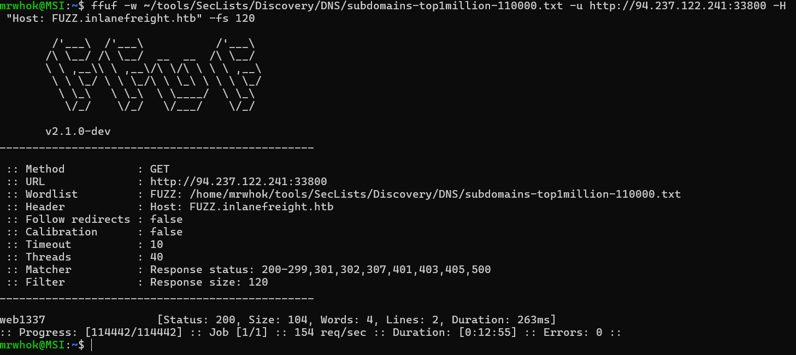
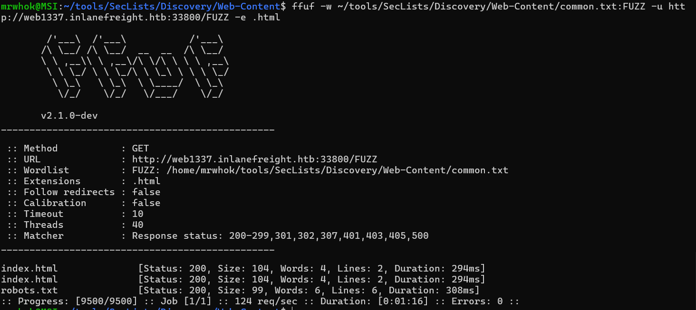
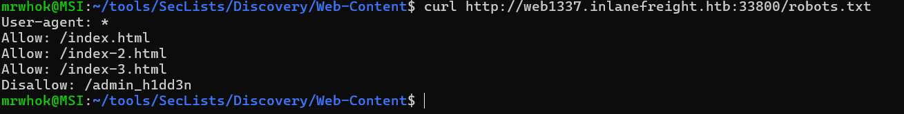
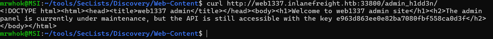

# HTB Academy - Information Gathering - Web Edition Write-up

## Table of Contents
1. [whois](#whois)
2. [DNS and Subdomains](#dns-and-subdomains)
    1. [Digging DNS](#digging-dns)
    2. [Subdomain Bruteforcing](#subdomain-bruteforcing)
    3. [DNS Zone Transfers](#dns-zone-transfers)
    4. [Virtual Host](#virtual-hosts)
3. [Fingerprinting](#fingerprinting)
4. [Crawling](#crawling)
5. [Web Archives](#web-archives)
6. [Automating Recon](#automating-recon)

## whois
### Tools
- whois

### Challenges
1. Perform a WHOIS lookup against the paypal.com domain. What is the registrar Internet Assigned Numbers Authority (IANA) ID number?

    We can solve this just by using `whois`.
    ```bash
    whois paypal.com
    ```
    Then we can look in the Registrar IANA ID line.

    

2. What is the admin email contact for the tesla.com domain (also in-scope for the Tesla bug bounty program)?

    Like in the previous, we can solve this using `whois` again.

    ```bash
    whois tesla.com
    ```
    Then we can look in the Registrant Email line.

    

## DNS and Subdomains
### Digging DNS
#### Tools
- dig
- nslookup
- host
- dnsenum
- fierce
- dnsrecon
- theHarvester
- Online DNS Lookup Services

#### Challenges
1. Which IP address maps to inlanefreight.com?

    To solve this we can use `dig` combine with `A` to retrive IPv4 address.

    ```bash
    dig inlanefreight.com A
    ```

    

2. Which domain is returned when querying the PTR record for 134.209.24.248?

    We can get the answer from the previous image. Here the details.

    

3. What is the full domain returned when you query the mail records for facebook.com?

    We can combine `dig` with MX to get the full domain when querying the mail record.

    ```bash
    dig facebook.com MX 
    ``` 
    

### Subdomain Bruteforcing
#### Tools
- dnsenum
- ffuf
- gobuster 
- fierce
- dnsrecon
- amass
- assetfinder	
- puredns

#### Challenges
1. Using the known subdomains for inlanefreight.com (www, ns1, ns2, ns3, blog, support, customer), find any missing subdomains by brute-forcing possible domain names. Provide your answer with the complete subdomain, e.g., www.inlanefreight.com.

    To solve this, we can use dnsenum with SecList wordlist.

    ```bash
    dnsenum --enum inlanefreight.com -f  /home/mrwhok/tools/SecLists/Discovery/DNS/subdomains-top1million-20000.txt
    ```

    Here the output.

    

### DNS Zone Transfers
#### Tools
- dig
#### Challenges
1. After performing a zone transfer for the domain inlanefreight.htb on the target system, how many DNS records are retrieved from the target system's name server? Provide your answer as an integer, e.g, 123.

    We can use dig to solve this.
    ```bash
    dig axfr inlanefreight.htb @10.129.140.80
    ```
    Here the result. 

    

    Based on that, the answer is 22. We count from first SOA until last SOA.

2. Within the zone record transferred above, find the ip address for ftp.admin.inlanefreight.htb. Respond only with the IP address, eg 127.0.0.1

    We can get the answer from the previous output.

3. Within the same zone record, identify the largest IP address allocated within the 10.10.200 IP range. Respond with the full IP address, eg 10.10.200.1

    The answer is 10.10.200.14 from the first output.

### Virtual Hosts
#### Tools
- gobuster
- Feroxbuster
- ffuf

### Challenges
1. Brute-force vhosts on the target system. What is the full subdomain that is prefixed with "web"? Answer using the full domain, e.g. "x.inlanefreight.htb"

    For faster and specific result, i used ffuf tools with filtering.

    ```bash
    grep '^web' "/home/mrwhok/tools/SecLists/Discovery/DNS/subdomains-top1million-110000.txt" | ffuf -u http://94.237.57.115:37780 -H "Host: FUZZ.inlanefreight.htb" -w - -fs 116
    ```

    The answer is `web17611`.

2. Brute-force vhosts on the target system. What is the full subdomain that is prefixed with "vm"? Answer using the full domain, e.g. "x.inlanefreight.htb"

    ```bash
    grep '^vm' "/home/mrwhok/tools/SecLists/Discovery/DNS/subdomains-top1million-110000.txt" | ffuf -u http://94.237.57.115:37780 -H "Host: FUZZ.inlanefreight.htb" -w - -fs 116
    ```

    The answer is `vm5`.

3. Brute-force vhosts on the target system. What is the full subdomain that is prefixed with "br"? Answer using the full domain, e.g. "x.inlanefreight.htb"

    ```bash
    grep '^br' "/home/mrwhok/tools/SecLists/Discovery/DNS/subdomains-top1million-110000.txt" | ffuf -u http://94.237.57.115:37780 -H "Host: FUZZ.inlanefreight.htb" -w - -fs 116
    ```

    The answer is `browse`.

4. Brute-force vhosts on the target system. What is the full subdomain that is prefixed with "a"? Answer using the full domain, e.g. "x.inlanefreight.htb"

    ```bash
    grep '^a' "/home/mrwhok/tools/SecLists/Discovery/DNS/subdomains-top1million-110000.txt" | ffuf -u http://94.237.57.115:37780 -H "Host: FUZZ.inlanefreight.htb" -w - -fs 116
    ```

    The answer is `admin`.

5. Brute-force vhosts on the target system. What is the full subdomain that is prefixed with "su"? Answer using the full domain, e.g. "x.inlanefreight.htb"

    ```bash
    grep '^su' "/home/mrwhok/tools/SecLists/Discovery/DNS/subdomains-top1million-110000.txt" | ffuf -u http://94.237.57.115:37780 -H "Host: FUZZ.inlanefreight.htb" -w - -fs 116
    ```

    The answer is `support`.

## Fingerprinting
### Tools
- Wappalyzer
- BuiltWith
- WhatWeb
- Nmap
- Netcraft
- wafw00f
- nikto
### Challenges
1. Determine the Apache version running on app.inlanefreight.local on the target system. (Format: 0.0.0)

    To solve this, we can use `CURL` with `-I` option.

    ```bash
    curl -I --resolve app.inlanefreight.local:80:10.129.208.33 http://app.inlanefreight.local
    ```
    The answer is `2.4.41`

2. Which CMS is used on app.inlanefreight.local on the target system? Respond with the name only, e.g., WordPress.

    We can solve this by using `CURL` again but with `-v` option.

    ```bash 
    curl -v --resolve app.inlanefreight.local:80:10.129.208.33 http://app.inlanefreight.local
    ```

    

    Based on the output, the answer is `Joomla`.

3. On which operating system is the dev.inlanefreight.local webserver running in the target system? Respond with the name only, e.g., Debian.

    Similar to first question, we can solve this with `CURL -I`.

    ```bash
    curl -I --resolve dev.inlanefreight.local:80:10.129.208.33 http://dev.inlanefreight.local
    ```

    The answer is `Ubuntu`.

## Crawling
### Tools
- Burp Suite Spider
- OWASP ZAP (Zed Attack Proxy)
- Scrapy (Python Framework)
- Apache Nutch (Scalable Crawler)
### Challenges
1. After spidering inlanefreight.com, identify the location where future reports will be stored. Respond with the full domain, e.g., files.inlanefreight.com.

    We can solve this by using ReconSpider.py. After that, we can see the answer on the comment section result.

    ```bash
    python ReconSpider.py https://inlanefreight.com
    ```

    The answer is `inlanefreight-comp133.s3.amazonaws.htb`.

## Web Archives
### Tools
- (Wayback Machine)[https://web.archive.org/]
### Challenges
1. How many Pen Testing Labs did HackTheBox have on the 8th August 2018? Answer with an integer, eg 1234.

    We can solve this using Wayback machine and use this url.
    ```
    https://www.hackthebox.eu/
    ```

    The answer is `74`.

2. How many members did HackTheBox have on the 10th June 2017? Answer with an integer, eg 1234.

    By using wayback machine like in the previous, the answer is `3054`.

3. Going back to March 2002, what website did the facebook.com domain redirect to? Answer with the full domain, eg http://www.facebook.com/

    From this [link](https://web.archive.org/web/20020328015153/facebook.com), the answer is `http://site.aboutface.com/`.

4. According to the paypal.com website in October 1999, what could you use to "beam money to anyone"? Answer with the product name, eg My Device, remove the ™ from your answer.

    From this [link](https://web.archive.org/web/19991013140707/http://paypal.com/), the answer is `Palm 0rganizer`.

5. Going back to November 1998 on google.com, what address hosted the non-alpha "Google Search Engine Prototype" of Google? Answer with the full address, eg http://google.com

    Go to this [link](https://web.archive.org/web/19981111184551/http://google.com/) and click `Google Search Engine Prototype` link, the answer is `http://google.stanford.edu/`.

6. Going back to March 2000 on www.iana.org, when exacty was the site last updated? Answer with the date in the footer, eg 11-March-99

    From this [link](https://web.archive.org/web/20000303211237/http://www.iana.org/), the answer is `17-December-99`.

7. According to wikipedia.com snapshot taken on February 9, 2003, how many articles were they already working on in the English version? Answer with the number they state without any commas, e.g., 100000, not 100,000.

    From this [link](https://web.archive.org/web/20030815000000*/wikipedia.com), the answer is `104155`.

## Automating Recon
### Tools
- FinalRecon
- Recon-ng
- theHarvester
- SpiderFoot
- OSINT Framework

## Skill Assesment
Before work on the task, i added domain to my host.
```bash
echo "94.237.123.119 inlanefreight.htb" | sudo tee -a /etc/hosts
```
1. What is the IANA ID of the registrar of the inlanefreight.com domain?

    We can solve this using `whois` and find IANA lines.

    ```bash
    whois inlanefreight.com
    ```

    The answer is `468`.

2. What http server software is powering the inlanefreight.htb site on the target system? Respond with the name of the software, not the version, e.g., Apache.

    We can solve this using `curl -I`.

    ```bash
    curl -I http://inlanefreight.htb:37249
    ```

    The answer is `nginx`.

3. What is the API key in the hidden admin directory that you have discovered on the target system?

    To solve this, in here i used `ffuf` to bruteforce the VHOSTS.
    
    ```bash
    ffuf -w ~/tools/SecLists/Discovery/DNS/subdomains-top1million-110000.txt -u http://94.237.122.241:33800 -H "Host: FUZZ.inlanefreight.htb" -fs 120
    ```

    Here the result, we find `web1337`.

    

    Then i modified /etc/hosts to add that vhosts, `94.237.122.241 inlanefreight.htb web1337.inlanefreight.htb`. After that, we used `ffuf` again but now to find any folder/file in there.

    ```bash
    ffuf -w ~/tools/SecLists/Discovery/Web-Content/common.txt:FUZZ -u http://web1337.inlanefreight.htb:33800/FUZZ -e .html
    ```

    

    We can see it have robots.txt. Here the content of it.

    

    It have suspicious path, `/admin_h1dd3n`. Then we check the content of it.

    

    Here we get the API Key. The answer is `e963d863ee0e82ba7080fbf558ca0d3f`.

4. After crawling the inlanefreight.htb domain on the target system, what is the email address you have found? Respond with the full email, e.g., mail@inlanefreight.htb.

    I have tried using `ReconSpider.py` to crawl `web1337.inlanefreight.htb` but its got nothing. So i tried to FUZZ again to find any VHOSTS from that.

    ```bash
    ffuf -w ~/tools/SecLists/Discovery/DNS/subdomains-top1million-110000.txt -u http://94.237.122.241:33800 -H "Host: FUZZ.web1337.inlanefreight.htb" -fs 120
    ```

    We get `dev` from that. Then i tried using `ReconSpider.py` again but with `dev.web1337.inlanefreight.htb`. Dont forget to add that in the /etc/hosts too.

    ```bash
    python ReconSpider.py http://dev.web1337.inlanefreight.htb:33800
    ```
    Then we can get the result in the email section from results.json. The answer is `1337testing@inlanefreight.htb`.

5. What is the API key the inlanefreight.htb developers will be changing too?

    We can get the answer from `ReconSpider.py` result in the comment section. The answer is `ba988b835be4aa97d068941dc852ff33`.